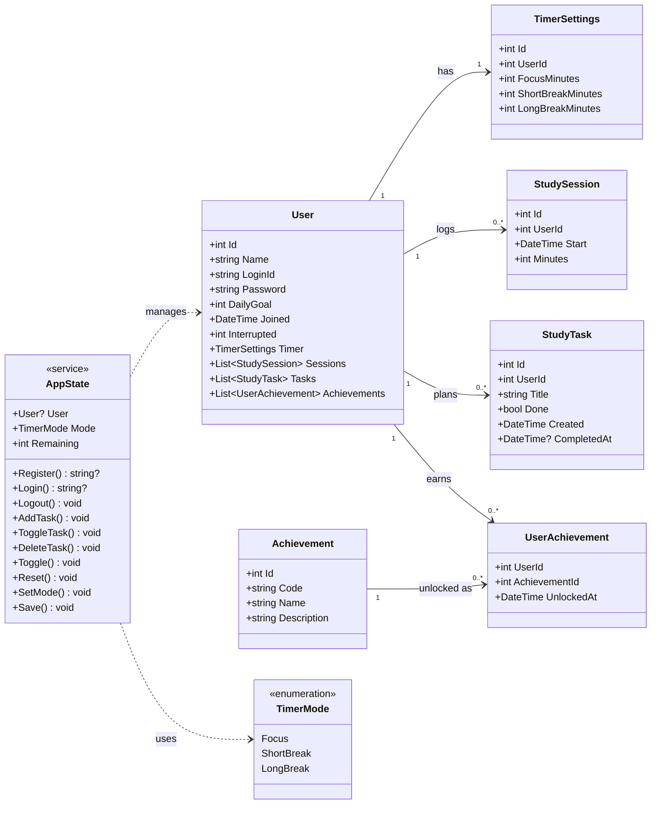

# FocusFuel Class Diagram

```mermaid
classDiagram
    direction LR
    class User {
        +int Id
        +string Name
        +string LoginId
        +string Password
        +int DailyGoal
        +DateTime Joined
        +int Interrupted
        +TimerSettings Timer
        +List~StudySession~ Sessions
        +List~StudyTask~ Tasks
        +List~UserAchievement~ Achievements
    }
    class TimerSettings {
        +int Id
        +int UserId
        +int FocusMinutes
        +int ShortBreakMinutes
        +int LongBreakMinutes
    }
    class StudySession {
        +int Id
        +int UserId
        +DateTime Start
        +int Minutes
    }
    class StudyTask {
        +int Id
        +int UserId
        +string Title
        +bool Done
        +DateTime Created
        +DateTime? CompletedAt
    }
    class Achievement {
        +int Id
        +string Code
        +string Name
        +string Description
    }
    class UserAchievement {
        +int UserId
        +int AchievementId
        +DateTime UnlockedAt
    }
    class TimerMode {
        <<enumeration>>
        Focus
        ShortBreak
        LongBreak
    }
    class AppState {
        <<service>>
        +User? User
        +TimerMode Mode
        +int Remaining
        +Register() string?
        +Login() string?
        +Logout() void
        +AddTask() void
        +ToggleTask() void
        +DeleteTask() void
        +Toggle() void
        +Reset() void
        +SetMode() void
        +Save() void
    }
    User "1" --> "1" TimerSettings : has
    User "1" --> "0..*" StudySession : logs
    User "1" --> "0..*" StudyTask : plans
    User "1" --> "0..*" UserAchievement : earns
    Achievement "1" --> "0..*" UserAchievement : unlocked as
    AppState ..> User : manages
    AppState ..> TimerMode : uses
```
